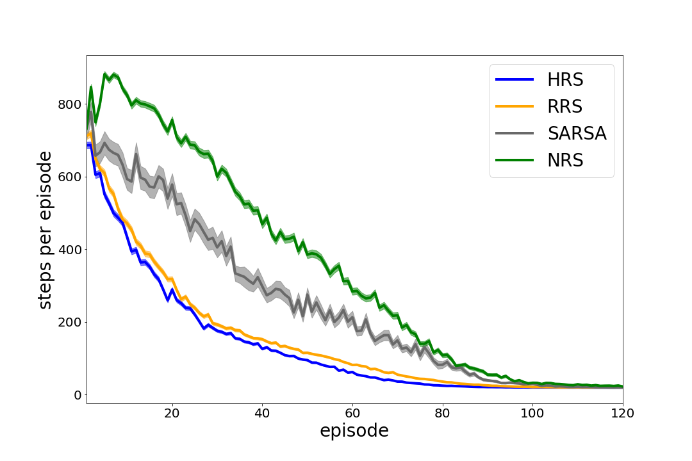
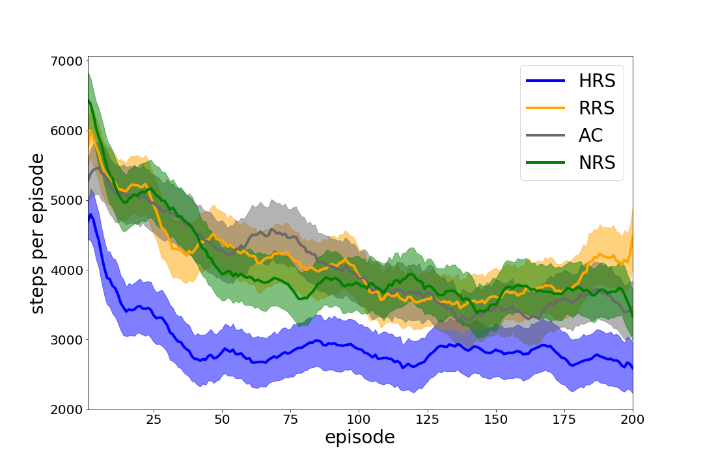

# Online Learning of Shaping Reward with Subgoal Knowledge

## Requirements
To install requirements and my environment libraries.
```
pip install -r requirements.txt
cd gym-fourrooms
pip install -e .
cd ../gym-pinball 
pip install -e .
``` 

# Training
1. Fourrooms
    To train the model(s) in the paper, run this command:

    ```
    cd learning/fourrooms
    bash run.sh
    ```

    You can switch the algorithm if you uncomment the other line in `run.sh`.
2. Pinball
    To train the model(s) in the paper, run this command:

    ```
    cd learning/pinball
    bash run.sh
    ```

    You can switch the algorithm if you uncomment the other line in `run.sh`.
# Analyze
1. Fourrooms
    
    To analyze my learning result(s)
    ```
    cd evaluate/fourrooms
    python analyze.py "../../learning/fourrooms/res/steps/*sarsa*" "../../learning/fourrooms/res/steps/*human-subgoal*"
    ```

2. Pinball
    
    To analyze my learning result(s)
    ```
    cd evaluate/pinball
    python analyze.py "../../learning/pinball/data/res/actor-critic_steps*"
    ```

3. Arrangement

    To output bar graphs with error, you fit `evaluate/<fourrooms|pinball>/out/mean_steps.csv` and `evaluate/<fourrooms|pinball>/out/standard_error.csv` into `evaluate/notebooks/in/results_<fourrooms|pinball>`, and calculate upper and lower value with excel or some tools.
    ```
    cd evaluate/notebooks
    jupyter notebook
    ```
    You will acquire bar graphs with error if you run notebook lines in order. 

# Results
## Learning curves in 4-rooms


## Learning curves in pinball

